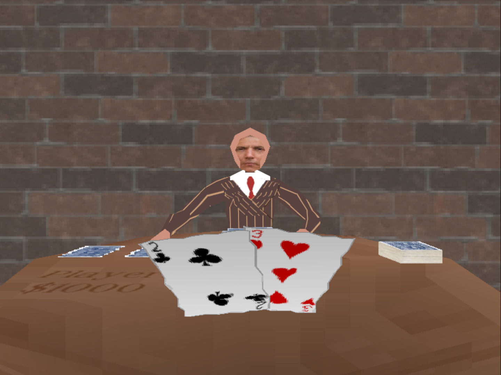
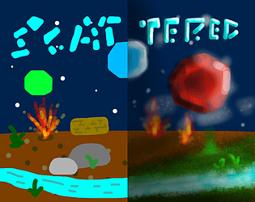

This year's game jam was a great success, and we recieved eight outstanding submissions.
Congratulations to all who participated! Submitted games can be played [here](https://itch.io/jam/woodlands-cs-club-jam-2025/entries).
Without further ado, the winners of our 2025 Game Jam are...

---

## 🥇 Escape the Evil School Simulator
Aaron Saini, Liheng Luo, Ajit Singh, Junyang Pu

  <a class="btn font-mono" href="https://xplayer150.itch.io/etess">Try on Itch.io!</a>

Escape the Evil School Simulator is an Andrew Dai awards appraised game created by the ETESS team for the Woodlands 2025 game jam. It has been a long journey, and we're really proud of it.

---

## 🥈 Ace Noir
Muhammad Haseeb

  <a class="btn font-mono" href="https://flanman20.itch.io/ace-noir">Try on Itch.io!</a>

You're a detective, coming back after a short stint with legal trouble, investigating a recent murder in a building. You go to investigate the "janitor" a local at a nearby bar. However, you find this bar has special rules, finding yourself playing poker with your past, and future on the line.

---

## 🥉 Scattered
Ethan Wang, Joshua Ah Yong

  <a class="btn font-mono" href="https://cheesyinthehead.itch.io/scattered">Try on Itch.io!</a>

The cards are scattered between the worlds. Collect the pairs of cards to win!